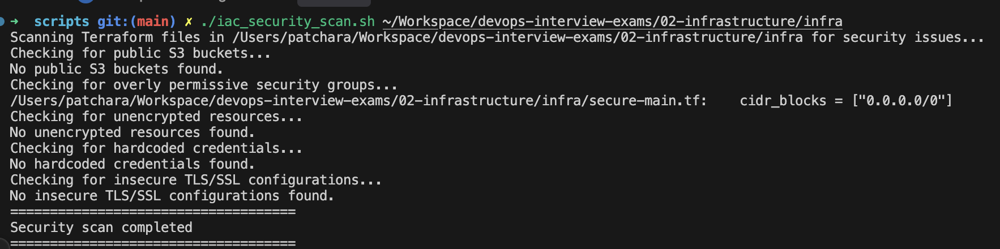

# IaC Expected Deliverables

## 1. Secure Terraform configuration
- Check at [secure-main.yaml](infra/secure-main.tf)

## 2. Infrastructure security scanning implementation
- CI runs Checkov on `infra/` (Terraform and Kubernetes manifests).
- The Checkov step runs before deployment.
- Results are available in the Actions logs.

## 3. Documentation of security improvements made
- Removed hardcoded AWS credentials in provider.
- Added variables for allowed CIDRs and private subnet.
- S3 bucket is private, versioned, encrypted (AES256). Public access blocked.
- Security group rules restricted. No `0.0.0.0/0` ingress. Egress limited to 443.
- EC2 root volume encrypted. Instance moved to a private subnet.
- Removed secrets from `user_data`.
- Replaced AdministratorAccess with a least-privilege inline policy.

## 4. Evidence of successful security scanning

