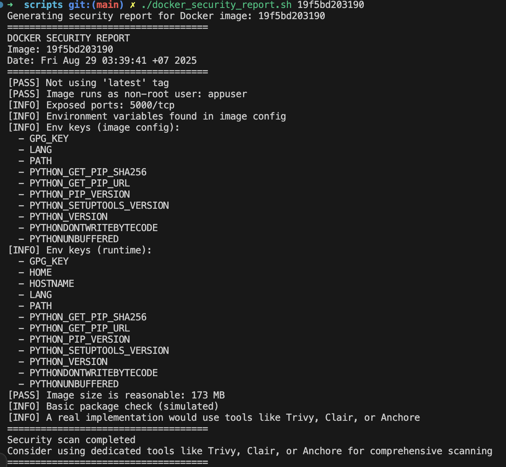

# Container Expected Deliverables

## 1. Secure Dockerfile
- Check at [Dockerfile](/03-container-security/secure/Dockerfile)

## 2. Container security scanning implementation

- CI scans images with Trivy.
- The job fails on HIGH and CRITICAL findings.
- Local check: `./scripts/docker_security_report.sh <image:tag>`.

## 3. Secure Kubernetes deployment manifests
- Check at [deployment.yaml](/03-container-security/secure/deployment.yaml)

## 4. Documentation of security improvements

- Dockerfile: pinned base by SHA.
- Dockerfile: multi-stage build.
- Dockerfile: no secrets in image.
- Dockerfile: non-root user via groupadd/useradd.
- Dockerfile: HEALTHCHECK with curl.
- Dockerfile: PATH set for user-local bin.
- Kubernetes: non-root securityContext.
- Kubernetes: liveness and readiness probes.
- Kubernetes: resource requests and limits.
- Kubernetes: secrets mounted via Secret.
- Kubernetes: Service is ClusterIP.
- Kubernetes: NetworkPolicy added.
- Kubernetes: PVC added for storage.

## 5. Evidence of successful container security scanning
- 
